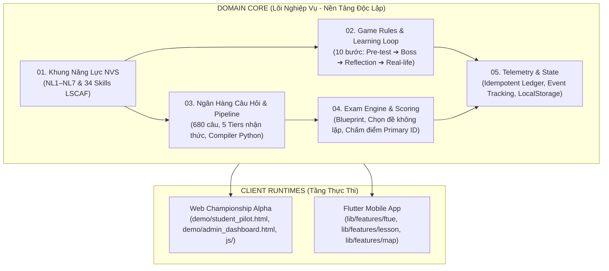

# NovaStars × NVS Championship Wiki — Mục Lục & Mô Hình Tư Duy Hệ Thống

> **Tài liệu tham chiếu chuẩn (Canonical Knowledge Base)**  
> Phiên bản: v1.0 (Frozen Specification)  
> Phong cách thiết kế: **Andrej Karpathy** (Nguyên lý đệ nhất, cô đọng, mật độ thông tin cao, tập trung tuyệt đối vào bản chất kỹ thuật và miền bài toán).

---

## 🌟 1. Bản Chất Sản Phẩm & Mục Tiêu Tối Thượng (North Star)

Hầu hết các ứng dụng EdTech trên thị trường thất bại vì tập trung vào việc **"hoàn thành bài học" (Lesson Completion)** hoặc **"điểm số bài kiểm tra" (Quiz Score)**.  

NovaStars được xây dựng từ nguyên lý đối lập:

$$\text{Giá trị thực} = \text{Sự thay đổi hành vi thực tế của trẻ em ngoài đời thực}$$

- **Sản phẩm là gì?** Nền tảng game phiêu lưu phát triển năng lực sống cho trẻ 6–11 tuổi (Tiểu học).
- **Hệ thống đánh giá như thế nào?** Không đo lường bằng việc trẻ nhớ mẹo gì, mà bằng khả năng ra quyết định trong tình huống mô phỏng và bằng chứng hành vi thực tế do phụ huynh xác nhận.
- **Vai trò của phụ huynh:** Phụ huynh **không phải là giáo viên** chấm bài. Phụ huynh là **người đồng hành xác nhận hành vi** (Behavior Verifier) kết nối bài học trong game với đời sống thực tế (ADR-011).

---

## 🧠 2. Mô Hình Tư Duy Kiến Trúc (Architecture Mental Model)

Toàn bộ hệ thống được chia thành hai lớp rõ rệt: **Domain Core (Lõi nghiệp vụ)** và **Client Runtimes (Tầng giao diện)**.

### Quy Luật Phụ Thuộc (Dependency Invariant)
- **Tầng Client Runtimes phụ thuộc vào Domain Core**: Cả Web HTML5 Prototype và Flutter Native App đều phải tuân thủ nghiêm ngặt các định nghĩa từ Domain Core.
- **Domain Core không phụ thuộc vào UI Widget**: Không bao giờ nhúng logic phân loại năng lực hay câu hỏi trực tiếp vào mã nguồn giao diện (ADR-006).

---

## 📚 3. Bản Đồ Điều Hướng Chuyên Đề (Wiki Directory Map)

Bộ Wiki này được chia thành 7 chuyên đề kỹ thuật chuyên sâu:

1. **[`01_COMPETENCY_FRAMEWORK.md`](file:///c:/Users/Nova/.gemini/antigravity/scratch/appcuocthi/wiki/01_COMPETENCY_FRAMEWORK.md)**:  
   *Khung Năng Lực NVS Chuẩn*: Chi tiết 7 Năng lực (NL1–NL7), mã màu hex, icon, bảng ánh xạ kế thừa từ hệ thống cũ (`LegacyCompetencyMigrationMap`), và danh mục 34 kỹ năng chi tiết theo chuẩn LSCAF.
2. **[`02_GAME_RULES_AND_LEARNING_LOOP.md`](file:///c:/Users/Nova/.gemini/antigravity/scratch/appcuocthi/wiki/02_GAME_RULES_AND_LEARNING_LOOP.md)**:  
   *Luật Game & Chu Trình Học*: Sơ đồ tuần hoàn học tập 10 bước (Core Learning Loop), nền kinh tế game (XP, Stars, Streak, Keys), triết lý "Thất bại tích cực" (Positive Failure) và thưởng cho nỗ lực.
3. **[`03_QUESTION_BANK_AND_PIPELINE.md`](file:///c:/Users/Nova/.gemini/antigravity/scratch/appcuocthi/wiki/03_QUESTION_BANK_AND_PIPELINE.md)**:  
   *Ngân Hàng Câu Hỏi & Quy Trình Biên Dịch*: Phân tầng nhận thức 5 Tiers (Biết -> Hiểu -> Tình huống -> Đánh giá -> Phản tư), schema câu hỏi chuẩn, pipeline chuyển đổi từ Markdown sang JS qua Python compiler.
4. **[`04_EXAM_ENGINE_SCORING_AND_BLUEPRINT.md`](file:///c:/Users/Nova/.gemini/antigravity/scratch/appcuocthi/wiki/04_EXAM_ENGINE_SCORING_AND_BLUEPRINT.md)**:  
   *Động Cơ Phòng Thi & Chấm Điểm*: Cấu trúc Blueprint đề thi, thuật toán chọn câu hỏi ngẫu nhiên chống lặp, thuật toán chấm điểm chuẩn hóa theo `primaryCompetencyId`, cơ chế chẩn đoán thận trọng (`evaluateCoachAdvice`).
5. **[`05_TELEMETRY_ANALYTICS_AND_STATE.md`](file:///c:/Users/Nova/.gemini/antigravity/scratch/appcuocthi/wiki/05_TELEMETRY_ANALYTICS_AND_STATE.md)**:  
   *Telemetry, Phân Tích & Quản Lý Trạng Thái*: Schema sự kiện học tập cho ban tổ chức (Admin Dashboard), kho lưu trữ `LocalStorageRepository`, sổ cái kinh tế chống cộng thưởng đúp (`Idempotent Ledger`).
6. **[`06_INVARIANTS_AND_ADR_GUARDRAILS.md`](file:///c:/Users/Nova/.gemini/antigravity/scratch/appcuocthi/wiki/06_INVARIANTS_AND_ADR_GUARDRAILS.md)**:  
   *Các Bất Biến & 20 Quyết Định Kiến Trúc (ADR)*: Tóm lược 20 ADRs cốt lõi (ADR-001 đến ADR-020), danh sách tính năng cấm làm (Non-Goals) và 10 quy tắc vàng ngăn chặn lỗi suy diễn của AI Agent.
7. **[`07_AI_AGENT_OPERATIONAL_PLAYBOOK.md`](file:///c:/Users/Nova/.gemini/antigravity/scratch/appcuocthi/wiki/07_AI_AGENT_OPERATIONAL_PLAYBOOK.md)**:  
   *Sổ Tay Vận Hành Tác Chiến Dành Cho AI Agent*: Bảng lệnh terminal chuẩn hóa (Node test, Python build, Playwright 4-8 workers, PowerShell token reset), và 5 recipes từng bước cho các tác vụ thường gặp nhất.

---

## ⚡ 4. Nguyên Tắc Đọc Dành Cho AI Agent

Khi nhận được một tác vụ từ người dùng:
1. **Xác định miền tác vụ**: Tác vụ liên quan đến câu hỏi, logic phòng thi, telemetry hay giao diện?
2. **Mở chuyên đề tương ứng**: Đọc tài liệu tương ứng trong bảng trên để nắm chắc schema và hàm chuẩn.
3. **Tuân thủ quy tắc bất biến**: Kiểm tra lại với [`06_INVARIANTS_AND_ADR_GUARDRAILS.md`](file:///c:/Users/Nova/.gemini/antigravity/scratch/appcuocthi/wiki/06_INVARIANTS_AND_ADR_GUARDRAILS.md).
4. **Thực thi và xác minh**: Dùng các recipe và lệnh kiểm thử trong [`07_AI_AGENT_OPERATIONAL_PLAYBOOK.md`](file:///c:/Users/Nova/.gemini/antigravity/scratch/appcuocthi/wiki/07_AI_AGENT_OPERATIONAL_PLAYBOOK.md) để kiểm tra kết quả trước khi kết thúc phiên.
