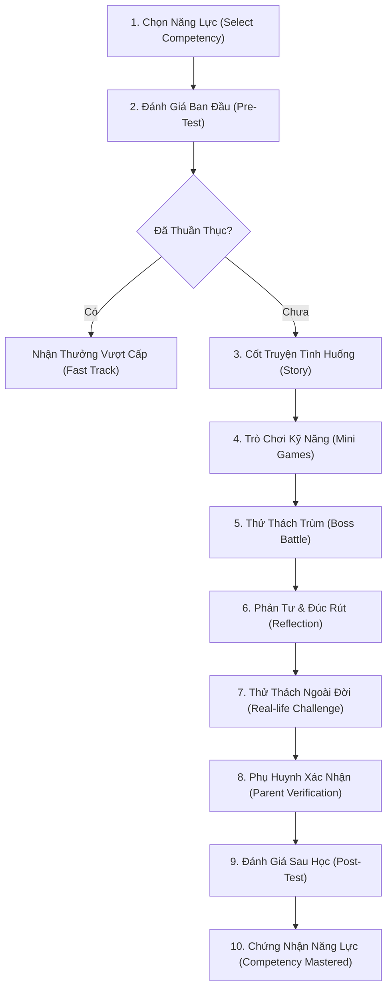

# 02 — Luật Game & Chu Trình Học Tập (Game Rules & Learning Loop)

> **Tài liệu tham chiếu:** [`MVP_CONTEXT.md`](file:///c:/Users/Nova/.gemini/antigravity/scratch/appcuocthi/MVP_CONTEXT.md), [`MVP_GAME_SYSTEM.md`](file:///c:/Users/Nova/.gemini/antigravity/scratch/appcuocthi/MVP_GAME_SYSTEM.md), [`NovaStars Decision Log`](file:///c:/Users/Nova/.gemini/antigravity/scratch/appcuocthi/extracted_docs/NovaStars%20Decision%20Log.txt)  
> **Nguyên lý cốt lõi:** Game tồn tại để phục vụ trải nghiệm học; Trải nghiệm học tồn tại để chuyển hóa thành hành vi thực tế.

---

## 🔄 1. Chu Trình Học Tập 10 Bước (The 10-Step Core Learning Loop)

Trái tim của NovaStars là chu trình học tập tuần hoàn kết hợp giữa **mô phỏng kỹ thuật số trong app** và **hành vi thực chứng ngoài đời thực**:

### Chi Tiết Từng Bước Trong Chu Trình:
1. **Chọn Năng Lực (`Select Competency`)**: Trẻ chọn một năng lực mục tiêu trên Bản đồ Phiêu lưu (World Map / Island).
2. **Đánh Giá Ban Đầu (`Pre-Test`)**: Bài kiểm tra nhanh xác định mức độ nhận thức hiện tại. Nếu trẻ đã thuần thục, cho phép vượt cấp để tránh nhàm chán.
3. **Cốt Truyện Tình Huống (`Story`)** *(ADR-003)*: Mọi bài học bắt đầu bằng một câu chuyện giàu cảm xúc. Trẻ em gắn kết với câu chuyện trước khi tiếp nhận kiến thức trừu tượng.
4. **Trò Chơi Kỹ Năng (`Mini Games`)**: Các tương tác minigame (kéo thả, phân loại, ghép nối) giúp trẻ thực hành kỹ năng một cách tự nhiên.
5. **Thử Thách Trùm (`Boss Battle`)**: Tình huống tổng hợp đòi hỏi áp dụng nhiều kỹ năng cùng lúc để vượt qua thử thách. Có thể chơi lại nhiều lần với kết quả phân nhánh.
6. **Phản Tư (`Reflection`)**: Trẻ nhìn nhận lại hành động của mình: *"Nếu gặp tình huống này ngoài đời, mình sẽ làm gì?"*
7. **Thử Thách Đời Thực (`Real-life Challenge`)** *(ADR-010)*: Yêu cầu thực hiện một hành động cụ thể ngoài thế giới thực (ví dụ: tự gấp quần áo, nói lời cảm ơn bố mẹ, lập danh sách an toàn trong nhà).
8. **Phụ Huynh Xác Nhận (`Parent Verification`)** *(ADR-011)*: Phụ huynh kiểm chứng hành vi thực tế của trẻ bằng một nút chạm đơn giản hoặc ảnh chụp. Phụ huynh là người đồng hành kết nối, không phải giáo viên chấm điểm.
9. **Đánh Giá Sau Học (`Post-Test`)**: Đo lường sự tiến bộ sau khi đã trải qua chuỗi hành động và phản tư.
10. **Chứng Nhận Năng Lực (`Competency Mastered`)**: Mở khóa sao, huy hiệu và đánh dấu năng lực đã đạt chuẩn trên hồ sơ học sinh.

---

## 💰 2. Nền Kinh Tế Trong Game (Game Economy)

Hệ sinh thái NovaStars thiết kế 4 đơn vị giá trị chính nhằm thúc đẩy động lực nội tại của trẻ:

| Đơn vị | Ký hiệu | Vai trò kỹ thuật & Sản phẩm | Nguồn nhận (Earn) | Ứng dụng tiêu thụ (Spend / Unlock) |
| :--- | :---: | :--- | :--- | :--- |
| **XP** (Experience Points) | ⚡ | Đo lường nỗ lực và thời lượng rèn luyện. Dùng xếp hạng thi đua. | Hoàn thành bài học, giải câu hỏi, duy trì streak, làm Daily Quest. | Tăng cấp độ phiêu lưu, leo bảng xếp hạng Championship. |
| **Stars** (Sao Năng Lực) | ⭐ | Đo lường độ thuần thục năng lực (Competency Mastery). | Vượt qua bài học, đánh bại Boss, hoàn thành thử thách đời thực. | Mở khóa đảo mới, bài học mới, đổi vé thi đấu (`ExamTicket`). |
| **Streak** (Chuỗi ngày) | 🔥 | Xây dựng thói quen rèn luyện đều đặn mỗi ngày. | Hoàn thành tối thiểu 1 hoạt động học tập trong ngày. | Nhận thưởng mốc streak (ngày thứ 3, 7, 14, 30), nhân hệ số XP. |
| **Exam Tickets** (Vé Thi) | 🎟️ | Quyền tham gia Đấu trường Đánh giá Năng lực NVS Championship. | Cấp phát hàng ngày (Daily allowance) hoặc đổi bằng 100 Stars. | Tiêu tốn 1 vé cho mỗi lượt bắt đầu bài thi Championship. |

---

## 🛡️ 3. Triết Lý Thiết Kế Trải Nghiệm Cốt Lõi

### Positive Failure — Thất Bại Tích Cực (ADR-012)
- **Tuyệt đối không trừng phạt sai lầm:** Trẻ chọn sai không bao giờ bị "Game Over", không bị trừ điểm số tích lũy, không bị nhốt màn hình.
- **Thất bại là dữ liệu để học:** Khi trẻ chọn đáp án sai, hệ thống cung cấp phản hồi dịu dàng, giải thích trực quan và khuyến khích trẻ thử lại:
  > *"Không sao cả! Lần đầu ai cũng có thể nhầm. Hãy cùng xem gợi ý này và thử lại nhé!"*

### Reward Growth, Not Only Correctness (ADR-013)
- Phần thưởng không chỉ dành cho điểm số 10/10.
- Hệ thống trao thưởng cho:
  - **Sự kiên trì:** Thử lại lần 2, lần 3 sau khi làm sai.
  - **Sự đều đặn:** Giữ vững Streak học tập qua các ngày.
  - **Hành động đời thực:** Hoàn thành nhiệm vụ phụ huynh xác nhận.

### Replay Must Have Purpose (ADR-014)
- Tính năng chơi lại không phải là làm lại đề thi y hệt để cày điểm.
- Trẻ chơi lại Boss Battle để:
  - Khám phá các nhánh kết truyện khác nhau.
  - Tối ưu hóa kỹ năng ra quyết định.
  - Nâng cao mức độ thuần thục năng lực từ Đồng $\rightarrow$ Bạc $\rightarrow$ Vàng.

---

## 📅 4. Nhiệm Vụ Hàng Ngày (Daily Quests)

Mỗi ngày người học nhận được bộ 3 nhiệm vụ đơn giản nhằm duy trì nhịp độ:
1. **Nhiệm vụ 1 (Bài học):** Hoàn thành 1 bài học bất kỳ trên bản đồ.
2. **Nhiệm vụ 2 (Rèn luyện):** Trả lời đúng 3 câu hỏi thuộc năng lực ưu tiên rèn luyện (`PRACTICE_PRIORITY`).
3. **Nhiệm vụ 3 (Đời thực):** Thực hiện 1 hành động rèn luyện kỹ năng ngoài đời thực có xác nhận của phụ huynh.
