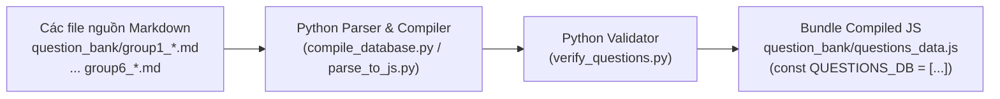

# 03 — Ngân Hàng Câu Hỏi & Pipeline Dữ Liệu (Question Bank & Pipeline)

> **Thư mục mã nguồn:** [`question_bank/`](file:///c:/Users/Nova/.gemini/antigravity/scratch/appcuocthi/question_bank/)  
> **Quy mô thiết kế:** 34 kỹ năng $\times$ 20 câu hỏi = **680 câu hỏi chuẩn hóa** theo khung LSCAF (*Hiện tại có 390 câu hỏi đang vận hành thực tế trong 6 file markdown nguồn, đã được kiểm định 100% không lỗi*).

---

## 🏗️ 1. Phân Tầng Nhận Thức 5 Tiers (LSCAF Cognitive Framework)

Mỗi kỹ năng trong ngân hàng câu hỏi bao gồm chính xác 20 câu hỏi, chia đều cho 5 tầng nhận thức theo khung chuẩn hóa:

| Tầng (Tier) | Số thứ tự câu | Tên tầng nhận thức | Bản chất yêu cầu đối với học sinh | Ví dụ tình huống |
| :---: | :---: | :--- | :--- | :--- |
| **Tier A** | 1 – 4 | **Knowledge (Biết)** | Nhận diện biển báo, quy tắc an toàn, định nghĩa cơ bản. | "Số điện thoại khẩn cấp gọi cứu hỏa là gì?" |
| **Tier B** | 5 – 8 | **Understanding (Hiểu)** | Hiểu nguyên nhân, vì sao phải làm như vậy, hậu quả nếu vi phạm. | "Vì sao không nên dùng nước dập lửa khi chập điện?" |
| **Tier C** | 9 – 12 | **Decision Making (Lựa chọn tình huống)** | Đưa ra quyết định hành động đúng đắn khi gặp tình huống thực tế. | "Khi ngửi thấy mùi khét trong nhà lúc bố mẹ vắng nhà, em sẽ làm gì đầu tiên?" |
| **Tier D** | 13 – 16 | **Judgment (Đánh giá hành vi)** | Đánh giá hành động của người khác là an toàn hay nguy hiểm, lịch sự hay bất lịch sự. | "Bạn Nam trèo lên lan can tầng 2 để với quả bóng, hành vi của bạn là..." |
| **Tier E** | 17 – 20 | **Transfer & Reflection (Vận dụng & Phản tư)** | Liên hệ bản thân, rút ra bài học và cam kết áp dụng vào đời sống hàng ngày. | "Em nên làm gì mỗi ngày để giữ an toàn cho bản thân khi dùng máy tính học tập?" |

---

## 📄 2. Cấu Trúc Dữ Liệu Câu Hỏi (Canonical Question Schema)

Mỗi câu hỏi trong bundle compiled [`questions_data.js`](file:///c:/Users/Nova/.gemini/antigravity/scratch/appcuocthi/question_bank/questions_data.js) tuân thủ nghiêm ngặt cấu trúc:

```typescript
interface QuestionItem {
  id: string;                      // Khóa duy nhất, ví dụ: 'Phong_tranh_di_lac_1'
  number: number;                  // Số thứ tự trong kỹ năng: 1 đến 20
  skill: string;                   // Tên kỹ năng chuẩn tiếng Việt
  tier: string;                    // Tầng nhận thức: 'A - Knowledge (Biết)',...
  group: string;                   // Nhóm phân loại bài học: 'Tự chăm sóc & An toàn',...
  question: string;                // Nội dung câu hỏi (ngữ văn thân thiện trẻ em)
  options: string[];               // Mảng 3 hoặc 4 phương án lựa chọn
  correct: number;                 // Index (0-indexed) của đáp án đúng (0, 1, 2, 3)
  explanation: string;             // Lời giải thích tích cực, đúc rút bài học (Positive Phrasing)
  primaryCompetencyId: string;     // BẮT BUỘC: Mã năng lực NVS chính (NL1..NL7)
  linkedCompetencyIds?: string[];  // KHÔNG BẮT BUỘC: Mảng các mã năng lực phụ liên đới
  ageGroup: 'GRADE_1_3' | 'GRADE_4_5'; // Phân nhóm lứa tuổi
}
```

### Ví dụ Thực Tế:
```json
{
  "id": "An_toan_khi_tham_gia_giao_thong_cong_cong_9",
  "number": 9,
  "skill": "An toàn khi tham gia các phương tiện giao thông công cộng",
  "tier": "C - Decision Making (Lựa chọn trong tình huống)",
  "group": "Tự chăm sóc & An toàn",
  "question": "Khi đang ngồi trên xe buýt, em thấy một bà cụ đứng bên cạnh tay xách nhiều đồ. Em nên làm gì?",
  "options": [
    "Nhìn ra ngoài cửa sổ vờ như không thấy",
    "Đứng dậy lễ phép mời bà cụ ngồi vào chỗ của mình",
    "Nói to để người khác nhường ghế cho bà"
  ],
  "correct": 1,
  "explanation": "Nhường ghế cho người già là hành động văn minh, thể hiện sự đồng cảm và trách nhiệm cộng đồng.",
  "primaryCompetencyId": "NL5",
  "linkedCompetencyIds": ["NL3", "NL4"],
  "ageGroup": "GRADE_1_3"
}
```

---

## ⚙️ 3. Pipeline Biên Dịch Dữ Liệu (The Compilation Pipeline)

Toàn bộ quy trình từ tài liệu thô sang bundle JavaScript phục vụ ứng dụng web chạy qua 3 công đoạn tự động:



### 1. File Nguồn Markdown (`question_bank/group*.md`):
- `group1_self_care_safety.md`: Kỹ năng chăm sóc bản thân và an toàn sinh tồn.
- `group2_self_management.md`: Quản lý cảm xúc, thời gian và kỷ luật cá nhân.
- `group3_thinking_learning.md`: Tư duy logic, phản biện và năng lực tự học.
- `group4_communication_collaboration.md`: Giao tiếp, làm việc nhóm và truyền cảm hứng.
- `group5_responsibility.md`: Trách nhiệm xã hội, công dân toàn cầu và đạo đức.
- `group6_financial_digital.md`: Quản lý tài chính cơ bản và kỹ năng công nghệ/AI.

### 2. Trình Biên Dịch & Kiểm Định:
- **`compile_database.py`**: Đọc các file JSON/Markdown thô, gán Tier nhận thức dựa trên số thứ tự câu (1–4: Tier A, 5–8: Tier B,...), chuẩn hóa ID và xuất ra file JS.
- **`verify_questions.py`**: Bộ kiểm thử tự động xác minh:
  - Mỗi kỹ năng có đủ 20 câu hỏi.
  - Số lượng lựa chọn `options` từ 3 đến 4.
  - Chỉ số `correct` nằm trong khoảng hợp lệ `0 <= correct < options.length`.
  - Thuộc tính `primaryCompetencyId` phải thuộc tập hợp canonical `NL1`..`NL7`.

### 3. Lệnh Thực Thi Biên Dịch:
```powershell
# Chạy kiểm thử xác minh dữ liệu câu hỏi
python question_bank/verify_questions.py

# Xuất bản dữ liệu sang bundle questions_data.js
python question_bank/parse_to_js.py
```
