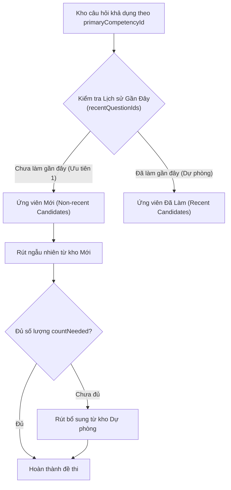
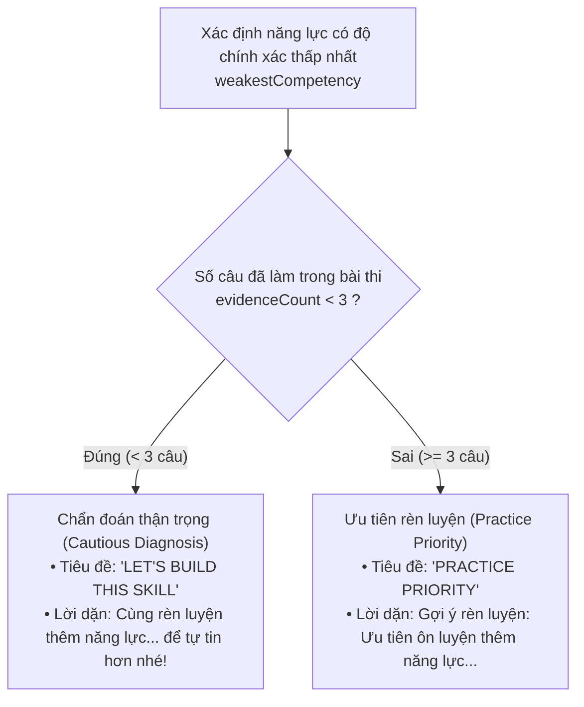

# 04 — Động Cơ Phòng Thi & Chấm Điểm (Exam Engine & Scoring)

> **File nguồn chuẩn xác:** [`js/services/exam_service.js`](file:///c:/Users/Nova/.gemini/antigravity/scratch/appcuocthi/js/services/exam_service.js), [`js/services/championship_analytics_engine.js`](file:///c:/Users/Nova/.gemini/antigravity/scratch/appcuocthi/js/services/championship_analytics_engine.js)  
> **Nguyên lý cốt lõi:** Tách biệt tuyệt đối giữa *Đánh giá học thuật thuần túy* và *Biến động kinh tế game*; Chấm điểm độc lập theo Năng lực chính (`primaryCompetencyId`).

---

## 📐 1. Cấu Trúc Đề Thi (ExamBlueprint)

`ExamBlueprint` định nghĩa khung cấu trúc của một bài thi Championship, quy định số lượng câu hỏi phân bổ cho từng năng lực:

```javascript
const ExamBlueprint_Alpha_5Q = {
  id: 'BLUEPRINT_ALPHA_5Q',
  title: 'Bài Thi Thử Nghiệm 5 Câu (Alpha Pilot)',
  totalQuestions: 5,
  timeLimitSeconds: 300, // 5 phút
  passAccuracyThreshold: 60, // Đạt từ 60% trở lên
  competencyDistribution: {
    NL1: 1, // 1 câu Mục đích sống
    NL2: 1, // 1 câu Tư duy học tập
    NL3: 1, // 1 câu Trí tuệ cảm xúc
    NL4: 1, // 1 câu Giao tiếp
    NL5: 1  // 1 câu Công dân toàn cầu
  }
};
```

### Thẩm Định Khả Thi (Blueprint Feasibility Validation)
Trước khi khởi tạo phòng thi, hàm `validateBlueprintFeasibility(blueprint, questionPool)` kiểm tra xem kho câu hỏi hiện tại có đáp ứng đủ số lượng câu hỏi yêu cầu cho từng năng lực hay không:
- **Tuyệt đối không bỏ qua vi phạm:** Nếu thiếu câu hỏi, hệ thống ném ngoại lệ rõ ràng `INSUFFICIENT_QUESTION_POOL: Question pool cannot satisfy blueprint`, không tự ý nhặt bù câu hỏi sai năng lực.

---

## 🎲 2. Thuật Toán Chọn Đề Chống Trùng Lặp (`selectQuestionsForBlueprint`)

Để học sinh không gặp lại các câu hỏi vừa làm trong các lượt thi gần nhất, thuật toán chọn câu hỏi vận hành theo cơ chế 2 lớp:



1. **Lọc theo `primaryCompetencyId`**: Chỉ lấy các câu hỏi có năng lực chính khớp với Blueprint.
2. **Ưu tiên câu hỏi mới (`nonRecentCandidates`)**: Lấy ngẫu nhiên từ tập hợp các câu hỏi chưa từng xuất hiện trong `recentQuestionIds` (lưu trữ lịch sử 20–50 câu gần nhất).
3. **Bổ sung an toàn**: Nếu kho câu hỏi mới không đủ, mới lấy thêm từ kho câu hỏi cũ để tránh lỗi treo đề thi.

---

## 🎯 3. Thuật Toán Chấm Điểm & Phân Tích Kết Quả

Hàm `evaluateAttemptAnswers()` xử lý việc tính toán kết quả bài làm:

### Quy Tắc Chấm Điểm Nghiêm Ngặt (Strict Scoring Invariant)
> **BẤT BIẾN:** Chỉ chấm điểm và gom nhóm kết quả theo `primaryCompetencyId`.  
> Tuyệt đối **KHÔNG** sử dụng `linkedCompetencyIds` để tính tỷ lệ chính xác hay phân loại năng lực. `linkedCompetencyIds` chỉ dùng cho mục đích hiển thị gợi ý mở rộng.

```javascript
// Trích xuất logic chấm điểm từ exam_service.js:
questions.forEach(q => {
  const compId = q.primaryCompetencyId || q.competencyId;
  const userAnswer = answers[q.id];
  const isCorrect = userAnswer !== undefined && Number(userAnswer) === Number(q.correct);

  if (isCorrect) totalCorrect++;

  if (!competencyStats[compId]) {
    competencyStats[compId] = { correct: 0, total: 0, accuracy: 0 };
  }
  competencyStats[compId].total++;
  if (isCorrect) {
    competencyStats[compId].correct++;
  }
});
```

### Kết Quả Trả Về (`ExamResult`):
- `totalScore`: Số câu đúng trên tổng số câu (ví dụ: `4/5`).
- `accuracyPercentage`: Tỷ lệ chính xác (ví dụ: `80%`).
- `passed`: `true` nếu `accuracyPercentage >= passAccuracyThreshold`.
- `weakestCompetency`: Năng lực có tỷ lệ chính xác thấp nhất cần cải thiện.
- `durationUsed`: Thời gian hoàn thành (tính bằng giây).

---

## 🛡️ 4. Chốt Chặn Chẩn Đoán Thận Trọng (`evaluateCoachAdvice`)

Hệ thống tuân thủ nguyên tắc giáo dục tích cực: **Không dán nhãn trẻ là "Yếu kém"**.

Hàm `evaluateCoachAdvice(examResult)` trong `ChampionshipAnalyticsEngine` áp dụng chốt chặn bảo vệ số lượng bằng chứng tối thiểu (**`minimumEvidenceCount`**, mặc định = 3):



- **Mục tiêu sư phạm:** Một đứa trẻ làm sai 1 câu trong một năng lực chỉ có 1 câu hỏi không đồng nghĩa với việc trẻ yếu năng lực đó. Hệ thống luôn dùng ngôn từ khích lệ: `"LET'S BUILD THIS SKILL"` thay vì chuẩn đoán tiêu cực.
