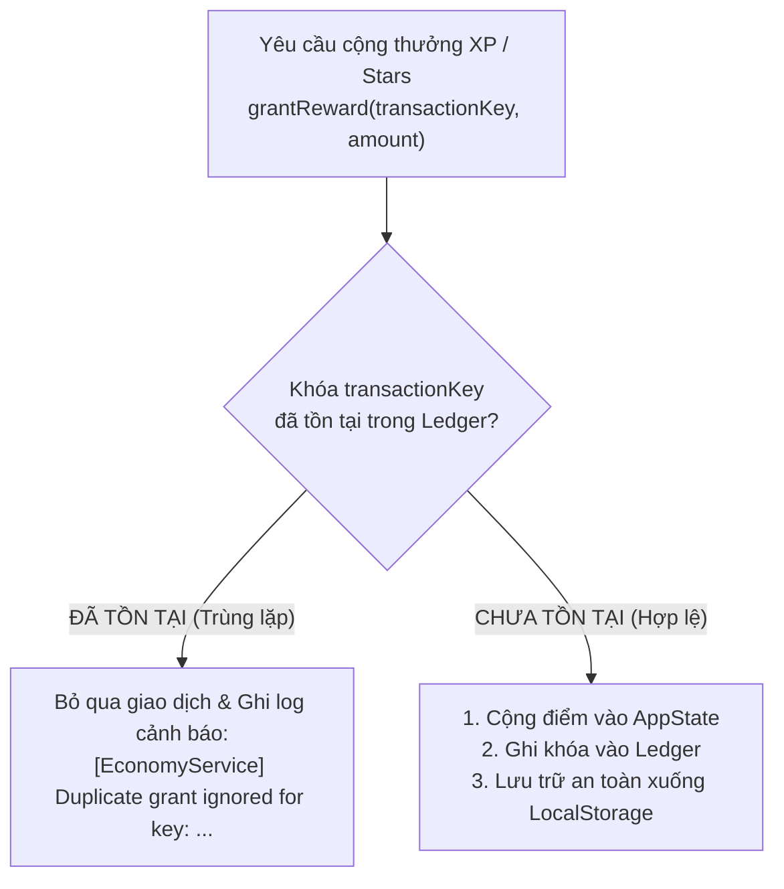
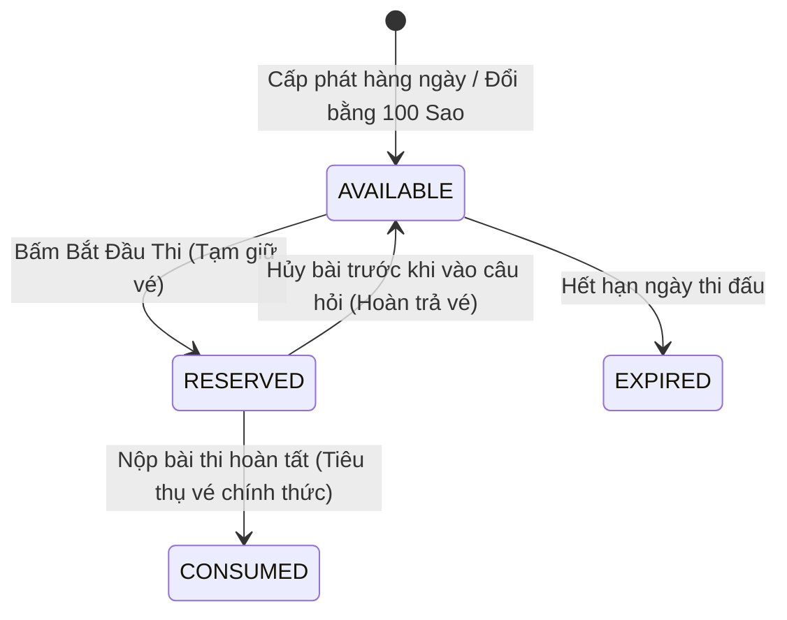

# 05 — Telemetry, Phân Tích & Quản Lý Trạng Thái (Telemetry, Analytics & State)

> **File nguồn chuẩn xác:** [`js/services/championship_analytics_engine.js`](file:///c:/Users/Nova/.gemini/antigravity/scratch/appcuocthi/js/services/championship_analytics_engine.js), [`js/services/championship_economy_service.js`](file:///c:/Users/Nova/.gemini/antigravity/scratch/appcuocthi/js/services/championship_economy_service.js), [`js/services/local_storage_repository.js`](file:///c:/Users/Nova/.gemini/antigravity/scratch/appcuocthi/js/services/local_storage_repository.js)  
> **Nguyên lý cốt lõi:** Dữ liệu hành vi thời gian thực minh bạch; Kinh tế game bảo vệ bằng Sổ cái Bất biến (Idempotent Ledger).

---

## 📡 1. Hệ Thống Telemetry & Giám Sát Thời Gian Thực (Admin Dashboard)

Hệ thống Telemetry ghi nhận toàn bộ chuỗi hành vi học sinh để cung cấp thông tin thời gian thực cho Ban Tổ Chức (BTC) tại [`demo/admin_dashboard.html`](file:///c:/Users/Nova/.gemini/antigravity/scratch/appcuocthi/demo/admin_dashboard.html):

### Schema Sự Kiện Chuẩn (Canonical Event Schema)
```typescript
interface TelemetryEvent {
  eventName: string;       // Tên sự kiện chuẩn
  timestamp: number;       // Unix epoch timestamp (milliseconds)
  payload: Record<string, any>; // Dữ liệu chi tiết của sự kiện
}
```

### Các Sự Kiện Cốt Lõi Được Thu Thập:

| Tên sự kiện (`eventName`) | Khi nào kích hoạt? | Payload đặc trưng |
| :--- | :--- | :--- |
| **`EXAM_STARTED`** | Học sinh bắt đầu làm bài thi | `{ attemptId, blueprintId, studentId, grade, totalQuestions }` |
| **`EXAM_QUESTION_ANSWERED`** | Học sinh chọn đáp án cho 1 câu hỏi | `{ attemptId, questionId, selectedAnswer, isCorrect, timeSpent }` |
| **`EXAM_SUBMITTED`** | Học sinh nộp bài thi thành công | `{ attemptId, totalScore, accuracy, durationSeconds, passed }` |
| **`SKILL_BOOST_COMPLETED`** | Học sinh hoàn thành 3 câu luyện tập | `{ sessionId, competencyId, questionsAnswered, xpEarned }` |
| **`STAR_TO_TICKET_EXCHANGED`** | Học sinh đổi 100 Sao lấy 1 Vé thi | `{ studentId, starsDeducted: 100, ticketId }` |

---

## 🔒 2. Sổ Cái Kinh Tế Bất Biến (Idempotent Ledger Economy Service)

Để ngăn chặn hoàn toàn lỗi cộng đúp điểm thưởng, gian lận hoặc lỗi bấm chuột liên tiếp (double click/re-submit), toàn bộ giao dịch trao thưởng được kiểm soát thông qua `ChampionshipEconomyService` sử dụng **Idempotent Ledger**:



### Quy Tắc Đặt Khóa Giao Dịch (`transactionKey`):
- **Thưởng nộp bài thi:** `EXAM_REWARD:{attemptId}`  
  *(Ví dụ: `EXAM_REWARD:att_101` $\rightarrow$ Đảm bảo một lượt thi chỉ được cộng điểm đúng một lần duy nhất).*
- **Thưởng câu hỏi rèn luyện (Skill Boost):** `SKILL_XP:{sessionId}:{questionId}`  
  *(Ví dụ: `SKILL_XP:sess_999:q_boost_cm_01` $\rightarrow$ Ngăn chặn việc làm lại cùng 1 câu trong một phiên để cày điểm vô hạn).*
- **Đổi vé thi đấu:** `EXCHANGE_TICKET:{timestamp}:{random}`

---

## 💾 3. Kho Lưu Trữ Cục Bộ (LocalStorage Repository)

Tất cả trạng thái của người chơi được lưu trữ dưới các namespace độc lập để tránh xung đột dữ liệu:

| Khóa lưu trữ (Storage Key) | Đối tượng quản lý | Cấu trúc dữ liệu chính |
| :--- | :--- | :--- |
| `novastars_player_state_v1` | Thông tin người chơi & chỉ số game | `{ user: { id, name, grade }, xp, stars, streak, completedNodes }` |
| `nvs_championship_tickets_v1` | Danh sách vé thi đấu của học sinh | `ExamTicket[]` (Mã vé, trạng thái, ngày hết hạn) |
| `nvs_championship_attempts_v1` | Lịch sử các lần làm bài thi | `ExamAttempt[]` (Lượt thi, câu hỏi đã làm, kết quả) |
| `nvs_championship_ledger_v1` | Sổ cái kiểm soát giao dịch chống trùng | `Record<string, { timestamp, amount, type }>` |

---

## 🎟️ 4. Vòng Đời Vé Thi & Lượt Thi (Tickets & Attempts Lifecycle)

Quy trình sử dụng vé thi được thiết kế nguyên tử (Atomic Operation) để không làm mất vé của học sinh khi gặp sự cố mạng hoặc tắt trình duyệt:



- **`TicketStatus`:** `AVAILABLE` $\rightarrow$ `RESERVED` $\rightarrow$ `CONSUMED` (hoặc `EXPIRED`).
- **`AttemptStatus`:** `IN_PROGRESS` $\rightarrow$ `SUBMITTED` (hoặc `ABANDONED`, `TIMEOUT`).
